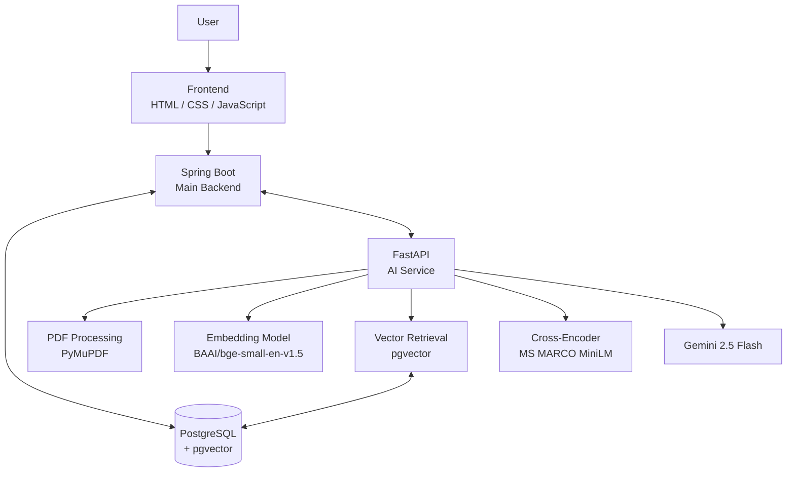
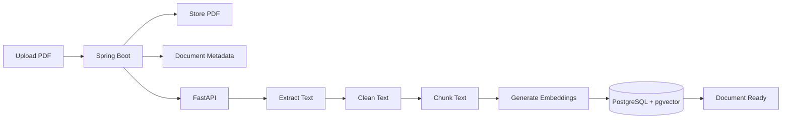
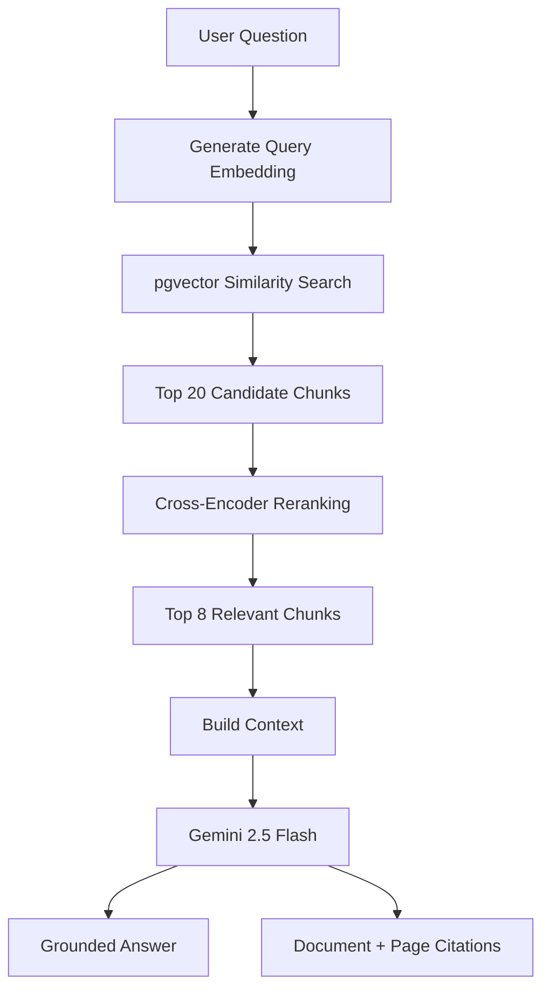
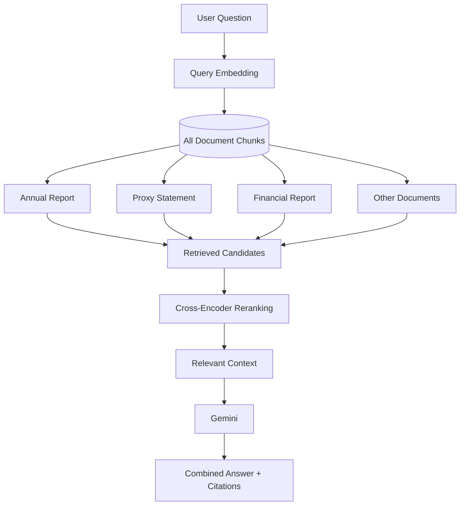
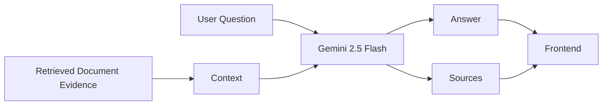
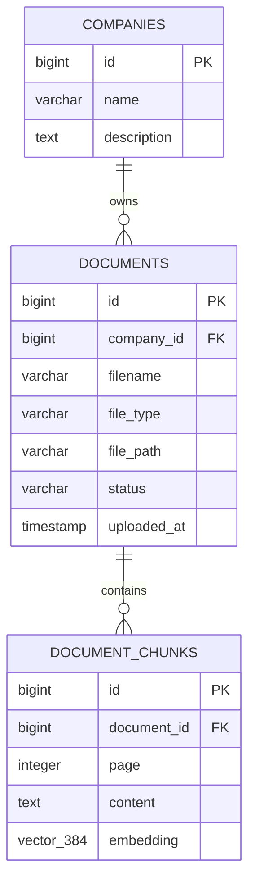
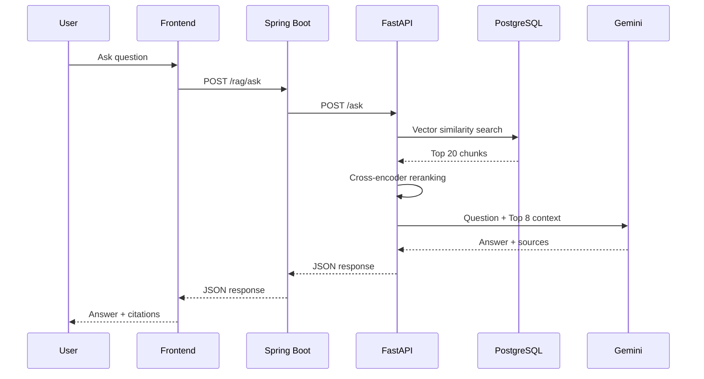
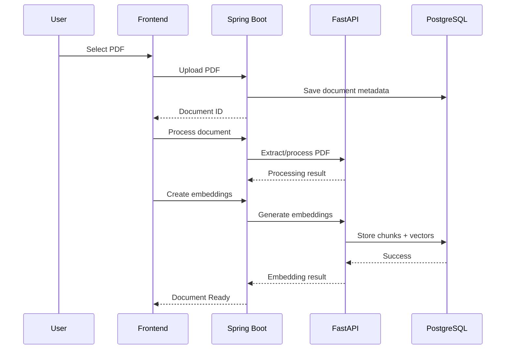
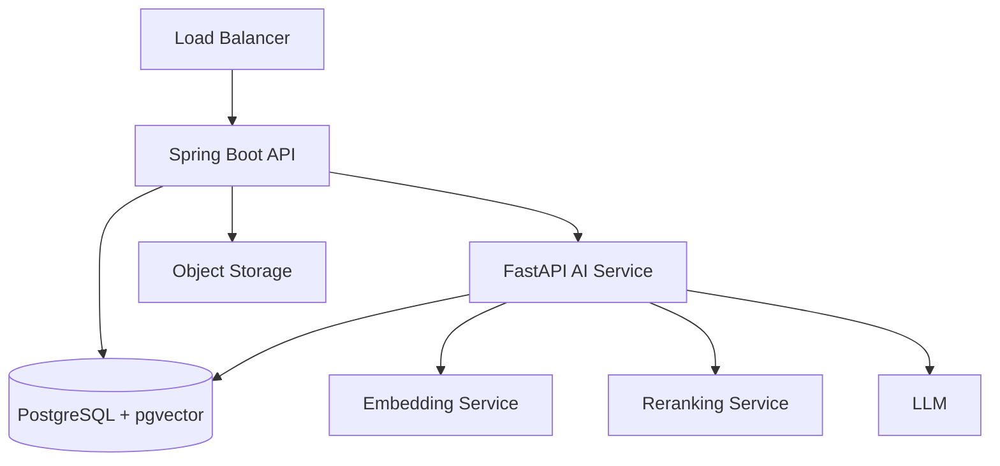

# InsightRAG — AI Business Intelligence Analyst

> An enterprise-style Retrieval-Augmented Generation (RAG) system for analyzing business documents with semantic retrieval, cross-encoder reranking, multi-document reasoning, and document/page-level citations.

---

## Overview

**InsightRAG** is an AI-powered Business Intelligence Analyst that lets users upload business documents and ask questions using natural language.

Instead of manually searching through lengthy annual reports, proxy statements, financial reports, and other business documents, users can ask questions such as:

- What was Microsoft's revenue in FY2025?
- What were the major drivers of revenue growth?
- Which business segment generated the highest revenue?
- What information is reported across multiple business documents?
- Which document and page support a particular claim?

InsightRAG uses **Retrieval-Augmented Generation (RAG)** to ground generated answers in uploaded documents.

The system:

1. Extracts text from PDFs.
2. Splits text into overlapping chunks.
3. Generates semantic embeddings.
4. Stores embeddings in PostgreSQL using pgvector.
5. Searches across all uploaded documents.
6. Reranks retrieved chunks using a cross-encoder.
7. Sends the most relevant context to Gemini.
8. Returns a concise answer with document/page citations.

---

# ✨ Key Features

- 📄 PDF document upload
- 🗂️ Persistent document management
- 🔎 Semantic vector search
- 📚 Multi-document retrieval
- 🎯 Cross-encoder reranking
- 🤖 Gemini-powered grounded generation
- 📌 Document and page-level citations
- 🗑️ Document deletion
- 🧠 Context-aware multi-document synthesis
- 🐘 PostgreSQL + pgvector
- ⚡ Spring Boot + FastAPI architecture
- 🌐 Lightweight HTML/CSS/JavaScript frontend

---

# 🏗️ System Architecture



### Architecture Responsibilities

| Layer | Responsibility |
|---|---|
| Frontend | User interface, uploads, chat, document management |
| Spring Boot | Main REST API, business logic, database access |
| PostgreSQL | Application data and document metadata |
| pgvector | Vector storage and similarity search |
| FastAPI | AI/RAG processing |
| PyMuPDF | PDF extraction |
| BGE | Text/query embeddings |
| Cross-Encoder | Retrieval reranking |
| Gemini | Grounded answer generation |

---

# 🔄 Complete Document Ingestion Workflow



### Current Chunk Configuration

```text
Chunk size: 1000 characters
Overlap:    200 characters
```

The overlap helps preserve context between neighboring chunks.

---

# 🔎 RAG Query Workflow



---

# 📚 Multi-Document Retrieval

Users do **not** need to select a document before asking a question.

The system searches across all uploaded document chunks.



This enables questions that require evidence from multiple documents.

For example:

> What financial performance information is reported in the annual report, and what executive compensation information is reported in the proxy statement?

The retrieval system can combine relevant chunks from both documents before sending the context to Gemini.

---

# 🧠 Retrieval Pipeline

InsightRAG uses a two-stage retrieval architecture.

```text
                    User Question
                          │
                          ▼
                BGE Query Embedding
                          │
                          ▼
              PostgreSQL + pgvector
                          │
                       Top 20
                          │
                          ▼
                 Cross-Encoder
                    Reranking
                          │
                        Top 8
                          │
                          ▼
                    LLM Context
                          │
                          ▼
                   Gemini 2.5 Flash
```

### Stage 1 — Semantic Retrieval

The question is converted into a 384-dimensional vector using:

```text
BAAI/bge-small-en-v1.5
```

The vector is compared against document chunk embeddings using pgvector.

### Stage 2 — Reranking

The initial candidates are scored using:

```text
cross-encoder/ms-marco-MiniLM-L-6-v2
```

This produces a more focused set of relevant chunks for the LLM.

---

# 🤖 Grounded Generation

Gemini is instructed to answer using **only the retrieved context**.

The prompt explicitly instructs the model to:

- Avoid outside knowledge.
- Avoid inventing facts.
- Answer directly.
- Combine evidence from multiple documents when necessary.
- Cite document names and page numbers.
- State when the provided documents do not contain enough information.

Conceptually:



---

# 📌 Source Citations

A typical response has the following structure:

```json
{
  "answer": "Microsoft reported revenue of $281.7 billion in FY2025.",
  "sources": [
    {
      "document": "2025_AnnualReport.pdf",
      "page": 24
    }
  ]
}
```

For a multi-document answer:

```json
{
  "answer": "The annual report provides financial performance information, while the proxy statement provides executive compensation information.",
  "sources": [
    {
      "document": "2025_AnnualReport.pdf",
      "page": 24
    },
    {
      "document": "2025_ProxyStatement.pdf",
      "page": 42
    }
  ]
}
```

The frontend renders these sources below the generated answer.

---

# 🗄️ Database Architecture



### Relationships

```text
Company
   │
   │ 1:N
   ▼
Documents
   │
   │ 1:N
   ▼
Document Chunks
   │
   └── 384-dimensional embedding
```

Document chunks use:

```sql
ON DELETE CASCADE
```

so deleting a document also removes its associated chunks and embeddings.

---

# 🧩 Project Structure

```text
InsightRAG/
│
├── frontend/
│   ├── index.html
│   ├── css/
│   │   └── style.css
│   └── js/
│       └── main.js
│
├── src/
│   └── main/
│       └── java/
│           └── com/
│               └── example/
│                   └── InsightRAG/
│
│                       ├── Controller/
│                       │   ├── Company_Controller.java
│                       │   ├── Document_Controller.java
│                       │   └── RAG_Controller.java
│                       │
│                       ├── Model/
│                       │   ├── Company.java
│                       │   ├── Document.java
│                       │   └── RAG_Request.java
│                       │
│                       ├── Repository/
│                       │   ├── CompanyRepository.java
│                       │   └── DocumentRepository.java
│                       │
│                       └── Service/
│                           ├── Company_Service.java
│                           ├── Document_Service.java
│                           └── RAG_Service.java
│
├── uploads/
├── main.py
├── pom.xml
└── README.md
```

---

# 🛠️ Technology Stack

## Frontend

- HTML5
- CSS3
- JavaScript
- Fetch API

## Backend

- Java
- Spring Boot
- Spring Web
- Spring Data JPA
- Hibernate
- Maven

## AI Service

- Python
- FastAPI
- PyMuPDF
- Sentence Transformers
- Cross-Encoder
- Google GenAI SDK

## Database

- PostgreSQL
- pgvector

## AI Models

### Embeddings

```text
BAAI/bge-small-en-v1.5
```

### Reranker

```text
cross-encoder/ms-marco-MiniLM-L-6-v2
```

### LLM

```text
Gemini 2.5 Flash
```

---

# 🌐 API Architecture

## Spring Boot APIs

### Upload Document

```http
POST /documents/upload/{companyId}
```

### Get Documents

```http
GET /documents
```

### Process Document

```http
POST /documents/process/{documentId}
```

### Create Embeddings

```http
POST /documents/embeddings/{documentId}
```

### Delete Document

```http
DELETE /documents/{documentId}
```

### Ask Question

```http
POST /rag/ask
```

---

## FastAPI APIs

### Health Check

```http
GET /
```

### Process PDF

```http
POST /process-document
```

### Extract PDF

```http
POST /extract-document
```

### Create Embeddings

```http
POST /create-embeddings/{document_id}
```

### RAG Query

```http
POST /ask
```

---

# 🔌 Service Communication



---

# 📄 Document Upload Sequence



---

# 🖥️ Frontend Workflow

The frontend provides:

```text
┌───────────────────────────────────────────┐
│              InsightRAG                   │
├───────────────┬───────────────────────────┤
│ Documents     │ AI Business Analyst       │
│               │                           │
│ + Upload      │ Ask questions about       │
│               │ uploaded documents        │
│ 📄 Report     │                           │
│ 📄 Proxy      │       Chat                │
│               │                           │
│               │ Sources                   │
│               │ 📄 Report · Page 24       │
└───────────────┴───────────────────────────┘
```

The document sidebar persists across browser refreshes by loading document metadata from:

```http
GET /documents
```

rather than relying only on frontend memory.

---

# 🔐 Configuration

## PostgreSQL

Example Spring Boot configuration:

```properties
spring.datasource.url=jdbc:postgresql://localhost:5432/insightrag
spring.datasource.username=YOUR_USERNAME
spring.datasource.password=YOUR_PASSWORD

spring.jpa.hibernate.ddl-auto=update
spring.jpa.show-sql=true
spring.jpa.properties.hibernate.format_sql=true

spring.servlet.multipart.max-file-size=100MB
spring.servlet.multipart.max-request-size=100MB
```

## Gemini

Never hardcode the Gemini API key.

Set:

```bash
export GEMINI_API_KEY="your-api-key"
```

The FastAPI service reads it using:

```python
os.getenv("GEMINI_API_KEY")
```

---

# 🚀 Local Setup

## 1. Clone

```bash
git clone https://github.com/<your-username>/InsightRAG.git
cd InsightRAG
```

## 2. PostgreSQL

Create the database:

```sql
CREATE DATABASE insightrag;
```

Enable pgvector:

```sql
CREATE EXTENSION vector;
```

Create the vector table if it is not created by your database setup:

```sql
CREATE TABLE document_chunks (
    id BIGSERIAL PRIMARY KEY,
    document_id BIGINT NOT NULL,
    page INTEGER NOT NULL,
    content TEXT NOT NULL,
    embedding VECTOR(384),

    CONSTRAINT fk_document
        FOREIGN KEY (document_id)
        REFERENCES documents(id)
        ON DELETE CASCADE
);
```

## 3. Spring Boot

Build:

```bash
./mvnw clean install
```

Run:

```bash
./mvnw spring-boot:run
```

Spring Boot:

```text
http://localhost:8080
```

## 4. FastAPI

Create an environment:

```bash
python -m venv venv
```

Activate it on macOS/Linux:

```bash
source venv/bin/activate
```

Install dependencies:

```bash
pip install fastapi uvicorn pymupdf psycopg2-binary pydantic sentence-transformers google-genai
```

Run:

```bash
uvicorn main:app --reload --port 8000
```

FastAPI:

```text
http://localhost:8000
```

## 5. Frontend

Open:

```text
frontend/index.html
```

using an IDE/local development server.

---

# 🔢 Current RAG Configuration

| Component | Configuration |
|---|---|
| Chunk size | 1000 characters |
| Chunk overlap | 200 characters |
| Embedding model | BAAI/bge-small-en-v1.5 |
| Embedding dimension | 384 |
| Initial retrieval | Top 20 |
| Reranker | ms-marco-MiniLM-L-6-v2 |
| Final context | Top 8 |
| Vector database | PostgreSQL + pgvector |
| LLM | Gemini 2.5 Flash |

---

# 📊 Example Document

The project has been tested using Microsoft's FY2025 Annual Report.

Example ingestion:

```text
Document:
2025_AnnualReport.pdf

Pages:
78

Chunks:
322

Embedding dimension:
384
```

Example questions:

```text
What was Microsoft's FY2025 revenue?

Which segment generated the highest revenue?

What were the major drivers of revenue growth?
```

---

# 💡 Example End-to-End Query

```text
User
 │
 │ "What was Microsoft's FY2025 revenue?"
 ▼
Frontend
 │
 │ POST /rag/ask
 ▼
Spring Boot
 │
 │ POST /ask
 ▼
FastAPI
 │
 ├── BGE embedding
 │
 ├── pgvector search
 │       └── Top 20
 │
 ├── Cross-encoder
 │       └── Top 8
 │
 └── Build context
          │
          ▼
     Gemini 2.5 Flash
          │
          ▼
     Grounded answer
          │
          ▼
     Source citation
          │
          ▼
       Frontend
```

---

# 🔮 Roadmap

## Retrieval Improvements

- [x] Semantic retrieval
- [x] Cross-encoder reranking
- [x] Multi-document retrieval
- [ ] Multi-query retrieval
- [ ] Query expansion
- [ ] Metadata-aware retrieval
- [ ] Context compression
- [ ] Citation validation
- [ ] Duplicate chunk prevention

## Business Intelligence

- [ ] CSV support
- [ ] Excel support
- [ ] Pandas-based analysis
- [ ] SQL-based analysis
- [ ] Hybrid document + structured-data queries
- [ ] Business metric calculations

## Platform

- [ ] User authentication
- [ ] Multiple company workspaces
- [ ] Role-based access control
- [ ] Persistent conversations
- [ ] Document versioning
- [ ] Async document processing
- [ ] Cloud deployment
- [ ] Monitoring and observability

---

# 🔒 Security

Do not commit:

```text
.env
GEMINI_API_KEY
uploads/
venv/
.idea/
```

Recommended `.gitignore`:

```gitignore
.env
venv/
__pycache__/
*.pyc
target/
.idea/
uploads/
```

For production, additional security should be implemented:

- Authentication
- Authorization
- Secure CORS
- File validation
- Malware scanning
- Rate limiting
- Secret management
- Database credential management
- API access controls

---

# 📈 Scalability Direction

The current architecture is intentionally simple enough for local development while providing a path toward a larger deployment.



This allows individual components to be scaled independently as usage grows.

---

# 🎯 Project Goals

InsightRAG is built around three core principles:

### Grounded

Answers should be based on the user's uploaded documents.

### Traceable

Important claims should be connected to document and page-level evidence.

### Modular

The application backend and AI pipeline are separated so retrieval, models, and business logic can evolve independently.

---

# 🧠 Learning Outcomes

This project demonstrates practical experience with:

### Software Engineering

- REST API development
- Spring Boot
- Spring Data JPA
- Hibernate
- PostgreSQL
- Entity relationships
- File upload systems
- Service/controller architecture

### AI / Machine Learning

- Embedding models
- Semantic search
- Vector databases
- Cross-encoder reranking
- Retrieval-Augmented Generation
- Prompt engineering
- LLM orchestration
- Grounded generation

### Full Stack

- HTML
- CSS
- JavaScript
- REST API integration
- Asynchronous requests
- Document management
- Chat interfaces

### System Design

- Service separation
- AI service architecture
- Database design
- Vector retrieval
- Multi-stage information retrieval
- Document processing pipelines
- Multi-document reasoning

---

# 👨‍💻 Author

**Subhankar Bose**

Computer Science Engineering Student

Areas of interest:

- Software Engineering
- Backend Development
- Artificial Intelligence
- Machine Learning
- Retrieval-Augmented Generation
- System Design

---

# 📄 License

This project is intended for educational and portfolio purposes.
